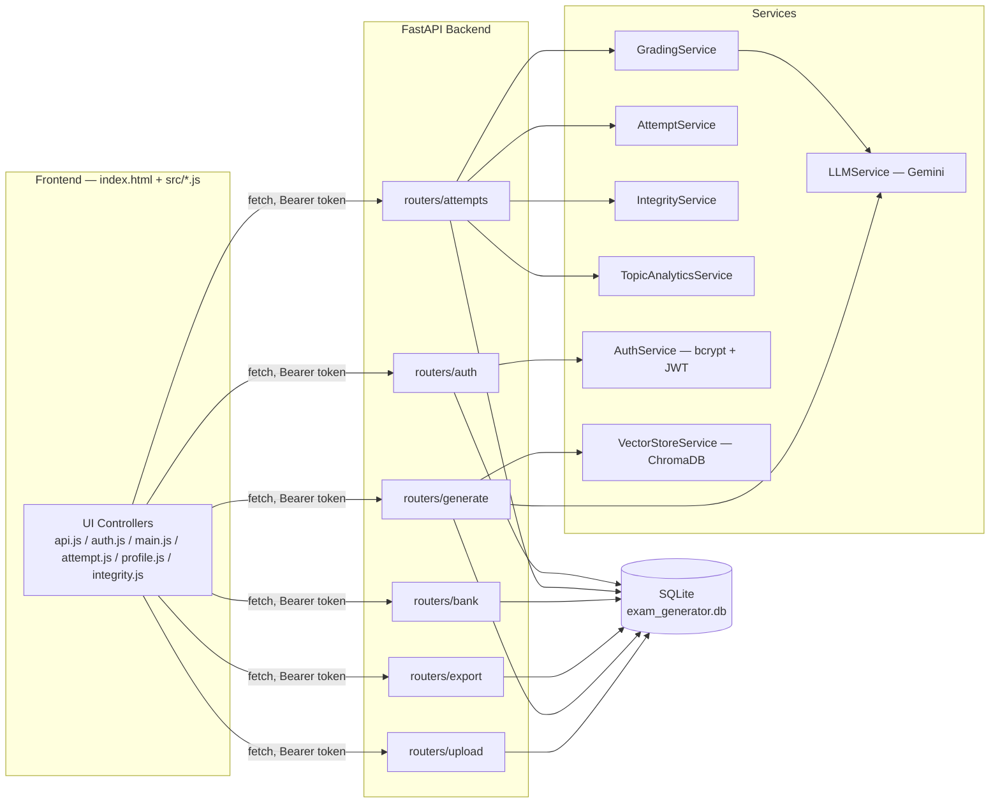
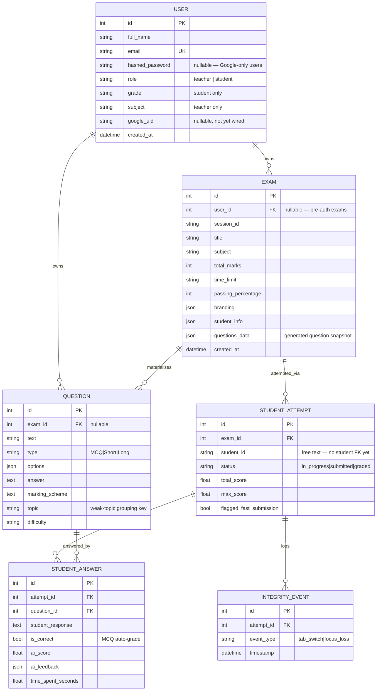

# Software Design Document — UstadExam

**Version:** 1.0 (reflects the codebase as of Phase 5 continuation)
**Author:** Mujeeb ur Rehman
**Status:** Living document — update as phases change the system.

---

## 1. Overview

UstadExam is an AI-powered exam generation, grading, and integrity-monitoring platform aimed at teachers and students in Pakistan. A teacher (or self-studying student) uploads study material, the system generates a formatted exam paper via an LLM, students attempt it in-app, and long-answer questions are graded by AI against a transparent, inspectable rubric.

The system was built incrementally across five phases:

| Phase | Scope |
|---|---|
| 1 | Core generation pipeline + exam-taking + AI grading (MCQ auto-grade, AI grading for short/long) |
| 2 | Grading transparency: "Why this score" rubric breakdown, ideal-answer comparison |
| 3 | Retention & practice: attempt history, score-over-time chart, weak-topic detection, "regenerate similar exam", timed mode |
| 4 | Anti-cheat & integrity logging: tab-switch/focus-loss tracking, fast-submission flagging, per-question timing, copy/paste blocking, teacher integrity panel |
| 5 | Branding ("UstadExam"), real email/password auth (+ Google Sign-In placeholder), Profile/Library restructuring, public Landing + Pricing pages, route guards, strict per-user data scoping |

---

## 2. Tech Stack

**Backend**
- Python 3.11, FastAPI, Uvicorn
- SQLAlchemy ORM over SQLite (`backend/data/exam_generator.db`)
- Raw SQL migrations (no Alembic) — `backend/db/migrations/*.sql`, applied by `run_migrations.py` (idempotent)
- Pydantic v2 schemas (`backend/models/schemas.py`)
- Google Gemini (`google-generativeai`, legacy SDK — deprecated upstream but functional) for generation and grading; `MOCK_MODE` env flag for offline dev testing
- ChromaDB + sentence-transformers for the vector store (semantic dedup / retrieval during generation)
- bcrypt (password hashing) + PyJWT (HS256, 7-day expiry) for auth

**Frontend**
- Vanilla JS, no build step — plain `<script>` tags
- Tailwind CDN (dev-only; flagged for a real build step before production)
- Chart.js (score-over-time), MathJax (math rendering in questions)
- Single-page app: one `index.html`, all "pages" are `.page-content` divs toggled by `switchPage()` — **no real browser URL routing** (no History API / pushState anywhere in the app)

**Dev/serving**
- Backend: `uvicorn main:app --host 127.0.0.1 --port 8000`
- Frontend: `python -m http.server 5500` (static files, no SPA fallback needed since there are no real routes)

---

## 3. Architecture



### Request/auth model
- Every protected endpoint independently validates a `Bearer` JWT via `get_current_user` (raises 401) — the frontend's route guards (`auth.js`) are UX-only convenience, **not** the enforcement point.
- `get_current_user_optional` is used where anonymous access should still work but an authenticated caller gets extra behavior (e.g. exam ownership attribution, Library scoping).

---

## 4. Data Model



**Known model debt:**
- `StudentAttempt.student_id` is a free-text field (email or manual ID), not a `User` FK — attempts/history are joined to a logged-in user by matching `student_id == user.email`, not a real foreign key. Left as-is since changing it means a migration touching every existing attempt row.
- `Question.topic` is set to the parent `Exam.subject` at materialization time — there's no true per-question topic classification, so weak-topic detection is really "weak subject" detection today.

---

## 5. API Surface

All routes are mounted under `/api`.

| Router | Key endpoints | Auth |
|---|---|---|
| `upload` | `POST /upload`, `POST /upload-logo` | none |
| `generate` | `POST /generate`, `POST /exams/{id}/regenerate` | optional (attributes ownership if logged in) |
| `export` | `POST /export` | none |
| `bank` | `GET /questions`, `POST /questions`, `GET /exams`, `DELETE /exams/{id}` | `GET /exams` optional — filters to caller's own exams when authenticated (Library scoping) |
| `attempts` | `POST /attempts/start`, `POST /attempts/{id}/submit`, `POST /attempts/{id}/grade`, `GET /attempts/{id}`, `GET /students/{id}/attempts`, `GET /students/{id}/weak-topics`, `POST /attempts/{id}/integrity-events`, `GET /exams/{id}/attempts/integrity` | none (student_id is free text) |
| `auth` | `POST /auth/register`, `POST /auth/login`, `POST /auth/google` (501 stub), `GET /auth/me`, `PUT /auth/me`, `GET /users/me/exams` | register/login public; rest require a Bearer token |

---

## 6. Frontend Structure

Single `frontend/index.html`; controllers loaded in this order:

```
api.js → auth.js → ui.js → main.js → attempt.js → profile.js → integrity.js
```

| File | Owns |
|---|---|
| `api.js` | All `fetch()` wrappers; `authHeaders()` attaches the JWT when present |
| `auth.js` | Session storage (`localStorage`), route guards, login/register/logout, nav auth-state toggling, Profile save, Landing/Pricing CTA routing |
| `main.js` | `switchPage()` (the single central nav function everything else calls into), Generate flow, Library (`#page-vault`) grid |
| `attempt.js` | Exam-taking state machine: timer, anti-cheat monitoring, submit/grade, "Why this score" accordion, ideal-answer comparison |
| `profile.js` | Profile header + editable account form; **also** owns `renderLibraryProgress()` — the score chart / weak-topics / attempt-history block rendered onto the Library page |
| `integrity.js` | Teacher-only integrity log panel |

### Page inventory

| Page id | Purpose | Auth |
|---|---|---|
| `landing` | Public marketing home (hero, vision, how-it-works, features, developer bio, pricing preview) | public |
| `pricing` | Full 3-tier pricing table + FAQ | public |
| `login` / `register` | Email/password auth (+ inactive Google button) | public; redirects to `generate` if already signed in |
| `generate` | Upload material → configure → generate exam | required |
| `vault` (nav label "Library") | Grid of *your own* generated exams + "My Learning Progress" (chart/history/weak topics) | required, strictly owner-scoped |
| `profile` | Account info + editable name/grade-or-subject + logout | required |
| `integrity` | Per-exam integrity log review | visible in nav to teachers only; page itself has no separate hard guard beyond the standard nav gating |
| `privacy` / `terms` | Static legal placeholders (flagged as needing real legal review) | public |
| `attempt` (owned by `attempt.js`, not in `main.js`'s page map) | Exam-taking UI | reached from Library, not nav-addressable directly |

### Navigation guard flow

```mermaid
sequenceDiagram
    participant U as User click / JS call
    participant SP as switchPage(pageId)
    participant Guard as requireAuthForPage()
    participant Page as target page

    U->>SP: switchPage('vault')
    SP->>Guard: requireAuthForPage('vault')
    alt protected page, not logged in
        Guard->>SP: switchPage('login'); return false
    else login/register, already logged in
        Guard->>SP: switchPage('generate'); return false
    else allowed
        Guard-->>SP: true
        SP->>Page: activate page, run page hook (loadVault / initProfilePage / initIntegrityPage)
    end
```

---

## 7. Key Design Decisions & Trade-offs

- **No real client-side routing.** Every "page" is a `switchPage()` DOM toggle, not a URL. Deep-linking to `/pricing` etc. doesn't work by typing it in a browser — only in-app navigation reaches it. Documented here rather than silently implied by page names.
- **Library is strictly per-owner (Phase 5 continuation).** `GET /api/exams` filters to `user_id == current_user.id` when authenticated. This closes off the old (Phases 1–4) behavior where any student could browse and take any exam in the system anonymously. There is currently no "assign exam to class" mechanism to reopen that path in a controlled way — a likely next feature given the Pricing page's "class-wide results dashboard" promise for Teacher Pro.
- **Google Sign-In is a real integration point, not implemented.** `routers/auth.py::google_auth()` returns `501`; the frontend button shows "coming soon". Wiring it up needs a real Firebase project's config, which only the project owner can create.
- **No payment processing.** Pricing page CTAs for paid tiers explain a manual JazzCash/EasyPaisa + WhatsApp confirmation flow — there is no billing backend, no plan/entitlement field on `User` yet.
- **`MOCK_MODE`** (env-gated, currently disabled) lets generation/grading run against canned responses instead of the real Gemini API, for dev testing without burning API quota.

---

## 8. Known Placeholders / Follow-ups

- Contact email in the footer (`hello@themujeeb.dev`) is a placeholder — replace before public launch.
- Privacy Policy and Terms pages are explicitly marked as dev placeholders needing real legal review (student/minor data handling in particular).
- No plan/entitlement enforcement exists yet for the Free/Student Pro/Teacher Pro tiers described on the Pricing page — the limits described there (2 generations/day, locked grammar checking, etc.) are not currently enforced server-side.
- `User.username` column is legacy/unused, kept only for backward compatibility with the original schema.
